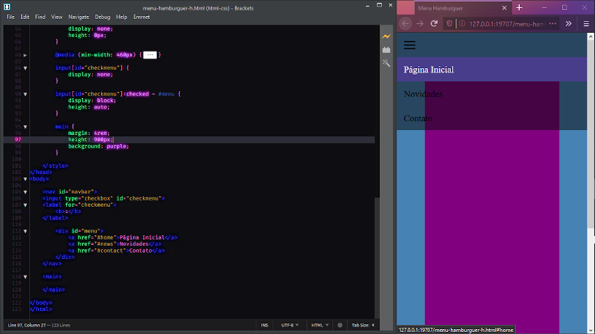

# MENU HAMBURGUER HORIZONTAL
Menu hamburguer criado com HTML e CSS usando o caractere ≡.  

### Ferramentas
Editor: [Brackets](http://brackets.io/)  
Navegador: [Mozilla Firefox](https://www.mozilla.org/pt-BR/firefox/new/)  

---
### GitHub: [**vh3rd7**](https://github.com/vh3rd7)  
_05/2020_  
